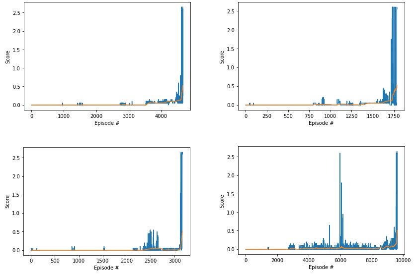

[image1]: tennis.png "Trained Agent"

# Project 3: Collaboration and Competition

### Introduction

In this environment, two agents control rackets to bounce a ball over a net. If an agent hits the ball over the net, it receives a reward of +0.1. If an agent lets a ball hit the ground or hits the ball out of bounds, it receives a reward of -0.01. Thus, the goal of each agent is to keep the ball in play.

The observation space consists of 8 variables corresponding to the position and velocity of the ball and racket. Each agent receives its own, local observation. Two continuous actions are available, corresponding to movement toward (or away from) the net, and jumping.

The task is episodic, and in order to solve the environment, the agents must get an average score of +0.5 (over 100 consecutive episodes, after taking the maximum over both agents). Specifically,

  * After each episode, we add up the rewards that each agent received (without discounting), to get a score for each agent. This yields 2 (potentially different) scores. We then take the maximum of these 2 scores.
    This yields a single score for each episode.
  * This yields a single score for each episode. 

![Unity ML-Agents Tennis Environment][image1]

The environment is considered solved, when the average (over 100 episodes) of those scores is at least +0.5.
### The Implementation

#### The Policy Neural Network

The Agent's Policy Neural Network consists (for each Agent - 2 in this case) of Actor's Neural Network `ActorNN`:

    class ActorNN(nn.Module):
        
        def __init__(self, state_size, action_size):
            super(ActorNN, self).__init__()
            self.fc1 = nn.Linear(state_size, 256)
            self.fc2 = nn.Linear(256, 128)
            self.fc3 = nn.Linear(128, 64)
            self.fc4 = nn.Linear(64, action_size)
            
    
        def forward(self, x):
            x = F.relu(self.fc1(x))
            x = F.relu(self.fc2(x))
            x = F.relu(self.fc3(x))
            x = F.tanh(self.fc4(x))
            return x

and Critic's Neural Network (for each Agent(2)) `CriticNN`:

    class CriticNN(nn.Module):
        
        def __init__(self, state_size, action_size):
            super(CriticNN, self).__init__()
            self.fc1 = nn.Linear(state_size+action_size, 256)
            self.fc2 = nn.Linear(256, 256)
            self.fc3 = nn.Linear(256, 64)
            self.fc4 = nn.Linear(64, 1)
            self.state_size = state_size
            self.action_size = action_size
    
        def forward(self, state, action):
            s = state.reshape(-1, self.state_size)
            a = action.reshape(-1, self.action_size)
            xs = torch.cat((s, a), dim=1)
            x = F.relu(self.fc1(xs))
            x = F.relu(self.fc2(x))
            x = F.relu(self.fc3(x))
            x = self.fc4(x)
            return x

There are 2 Agents in Unity Tennis Environment.

 - Each Agent's Actor network takes in it's own observed state (with length: 24) and returns action (Size of each action: 2).
 - Each Agent's Critic network takes in it's own observed state and action taken (size: 24+2=26) to return the estimated Value of this combination (size: 1)

#### The Agent - Multi-Agent Deep Deterministic Policy Gradient (MADDPG)

##### Initialization

The Agent is initialized with 4 Neural Networks in total:
 - 2 (Local and Target) for the Agent's Policy to pick actions (see above) and Adam optimizer (with Learning rate from hyperparameters).
 - 2 (Local and Target) for the Agent's Value estimation (of the state and action pair; see above) and Adam optimizer (with Learning rate and Weight decay from hyperparameters; Note: Weight decay with positive values fails to train the Agent)
 - initially Local and Target networks have same weights (see `hard_update` method).

The Agent has memory Buffer (hyperparameters `BUFFER_SIZE` and `BATCH_SIZE`) which during exploration is filled with Agents' experiences (s, a, r, s') and from which Agents' Neural Networks learn by taking random sample of these experiences. By having bigger `BATCH_SIZE` parameter the Agent learns more from collected samples but in real time it takes more time to learn (big batches take more time to execute single learning step) and is more prone to overfitting. By trying various sizes it seems the optimal is 128 (see parameter_history.xlsx)

The Agents' actions are added with [Ornstein–Uhlenbeck process](https://en.wikipedia.org/wiki/Ornstein%E2%80%93Uhlenbeck_process) noise in order to help learning. The parameters for `OUNoise` are:

 - mu: 0
 - theta: 0.15
 - sigma: 0.1
 - scale_start: 0.99

I had mixed results by varying `sigma` parameter. By adding too much noise (increasing `sigma`) the Agent never learns, on the other hand by having too small sigma the Agents learns very slow. By having `sigma` equal to 0.1 the Agent learned more consistently.

##### Hyper parameters

The hyperparameters that Agent was able to solve the Environment are:

    hyperparameters = {
        'BUFFER_SIZE' : int(1e6),  # replay buffer size
        'BATCH_SIZE' : 128,        # minibatch size
        'GAMMA' : 0.99,            # discount factor
        'TAU' : 0.001,             # for soft update of target parameters
        'LR_ACTOR' : 0.0001,       # learning rate of the actor
        'LR_CRITIC' : 0.0001,      # learning rate of the critic
        'WEIGHT_DECAY' : 0,        # L2 weight decay
        'UPDATE_EVERY' : 4,        # learn every UPDATE_EVERY time steps
        'step_n_updates' : 4       # number of updates during each step (from memory)
    }

##### Learning

The most important part of the Agent is the `.learn` method. 

        """Update policy and value parameters using given batch of experience tuples.
        Q_targets = r + γ * critic_target(next_state, actor_target(next_state))
        where:
            actor_target(state) -> action
            critic_target(state, action) -> Q-value
        Params
        ======
            experiences (Tuple[torch.Tensor]): tuple of (s, a, r, s', done) tuples
            gamma (float): discount factor
        """

###### Updating Critic's Local network
In the first part of this method the Agent Critic's Local network is updated. 

 - First predicted actions are calculated according to Actor's Target network, 
 - Then Q_targets_next are estimated with Critic's Target network (according to predicted Actor's Target network Actions)
 - Then current State Value `Q_targets` is estimated according to Critic's Target network (by summing actual Reward with future Value estimates of the Critic's Target network discounted with hyper parameter `GAMMA`. (Discounting estimated future Value more did not help learning, see parameter_history.xlsx))
 - Then current State Value `Q_expected` is estimated according to Critic's Local network 
 - Then Mean Square Loss is computed between the Networks' estimates and Critic's Local network's paramaters are updated accordingly (note the gradient norm is clipped with max_norm=1)

        # ---------------------------- update critic ---------------------------- #
        # Get predicted next-state actions and Q values from target models
        actions_next = self.actor_target(next_states)
        Q_targets_next = self.critic_target(next_states, actions_next)
        # Compute Q targets for current states (y_i)
        Q_targets = rewards + (gamma * Q_targets_next * (1 - dones))
        # Compute critic loss
        Q_expected = self.critic_local(states, actions)
        critic_loss = F.mse_loss(Q_expected, Q_targets)
        # Minimize the loss
        self.critic_optimizer.zero_grad()
        critic_loss.backward()
        torch.nn.utils.clip_grad_norm_(self.critic_local.parameters(), 1)
        self.critic_optimizer.step()

###### Updating Actor's Local network
In the second part of the `.learn` method the Agent Actor's Local network is updated.
Here the Actor's Loss is simply estimated according to Critic's Local network 

        # ---------------------------- update actor ---------------------------- #
        # Compute actor loss
        actions_pred = self.actor_local(states)
        actor_loss = -self.critic_local(states, actions_pred).mean()
        # Minimize the loss
        self.actor_optimizer.zero_grad()
        actor_loss.backward()
        torch.nn.utils.clip_grad_norm_(self.actor_local.parameters(), 1)
        self.actor_optimizer.step()

###### Updating Target networks
In the third and last part of the `.learn` method the Agent's Actor's and Critic's Target networks' weights are updated with `soft_update`:

 - θ_target = τ*θ_local + (1 - τ)*θ_target

The parameter`TAU` helps to smoothly and more gradually copy the online network weights to the target network at each step.
 
### Achieved performance
The current implementation is expected to achieve desired performance (average score of last 100 episodes >= 0.5) in about 4000 Episodes of training (Note: estimation was made according last 7 training runs: median([2425,11218,4674,3878,1786,3160,9600])=3878). 

By letting the Agent to train achieving Average score of >=2.5, this implemetation's single test took 10429 Episodes:

      Episode 100	Average Score: -0.0050
      ...
      Episode 6600	Average Score: 0.7287
      ...
      Episode 8000	Average Score: 2.3687
      Episode 8100	Average Score: 1.9078
      Episode 8200	Average Score: 0.9854
      Episode 8300	Average Score: 0.9612
      Episode 8400	Average Score: 1.2185
      Episode 8500	Average Score: 1.4303
      Episode 8600	Average Score: 2.0464
      Episode 8700	Average Score: 2.3197
      Episode 8800	Average Score: 2.2875
      Episode 8900	Average Score: 1.9631
      Episode 9000	Average Score: 2.0420
      Episode 9100	Average Score: 1.8019
      Episode 9200	Average Score: 2.0503
      Episode 9300	Average Score: 2.3235
      Episode 9400	Average Score: 2.3337
      Episode 9500	Average Score: 2.2906
      Episode 9600	Average Score: 2.0871
      Episode 9700	Average Score: 1.9934
      Episode 9800	Average Score: 1.2042
      Episode 9900	Average Score: 1.0103
      Episode 10000	Average Score: 1.7949
      Episode 10100	Average Score: 2.1196
      Episode 10200	Average Score: 1.9823
      Episode 10300	Average Score: 2.3242
      Episode 10400	Average Score: 2.4034
      Episode 10429	Average Score: 2.5101
      Environment solved in 10429 episodes!	Average Score: 2.51

And the test run was completed flawlessly:

      Averaged score between agents, episode 1: 2.600000038743019
      Averaged score between agents, episode 2: 2.650000039488077
      Averaged score between agents, episode 3: 2.600000038743019
      Averaged score between agents, episode 4: 2.650000039488077
      Averaged score between agents, episode 5: 2.600000038743019
      Averaged score between agents, episode 6: 2.600000038743019
      Averaged score between agents, episode 7: 2.650000039488077
      Averaged score between agents, episode 8: 2.600000038743019
      Averaged score between agents, episode 9: 2.650000039488077
      Averaged score between agents, episode 10: 2.600000038743019

### Future improvements

The current implementation is very sensitive and required a lot of manual hyper parameters tuning. Probably MADDPG is not the best algorithm for the current task, so alternative algorithms (or networks) would be interesting to compare:
The Agent could be improved in many ways:
* implement ensemble MADDPG
* try smaller networks
* it would be interesting to implement Convolutional Neural Network for the Agent to get information for the local data paterns (between sequential states) and maybe learn the more important parts of the state change. (Also maybe LSTM would work too) 
* it would be interesting to try to implement the Embedding layer from the Replay Buffer to find co-occurant states and estimate their Values by that.
* *better performance* - by training longer, increasing Replay Buffer, using more sophisticated Policy Network could improve Agent's Policy by achieving higher scores than threshold.
* by implementing other algorithms - DDPG, A3C, D4PG and others.
* it would be interesting to try implementing the Attention mechanism for this Agent.

